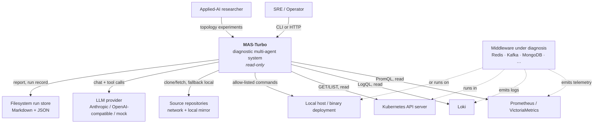
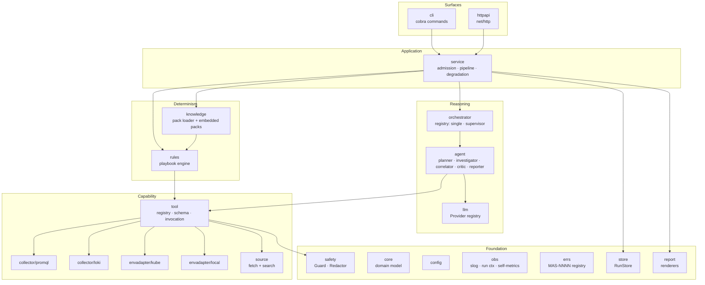
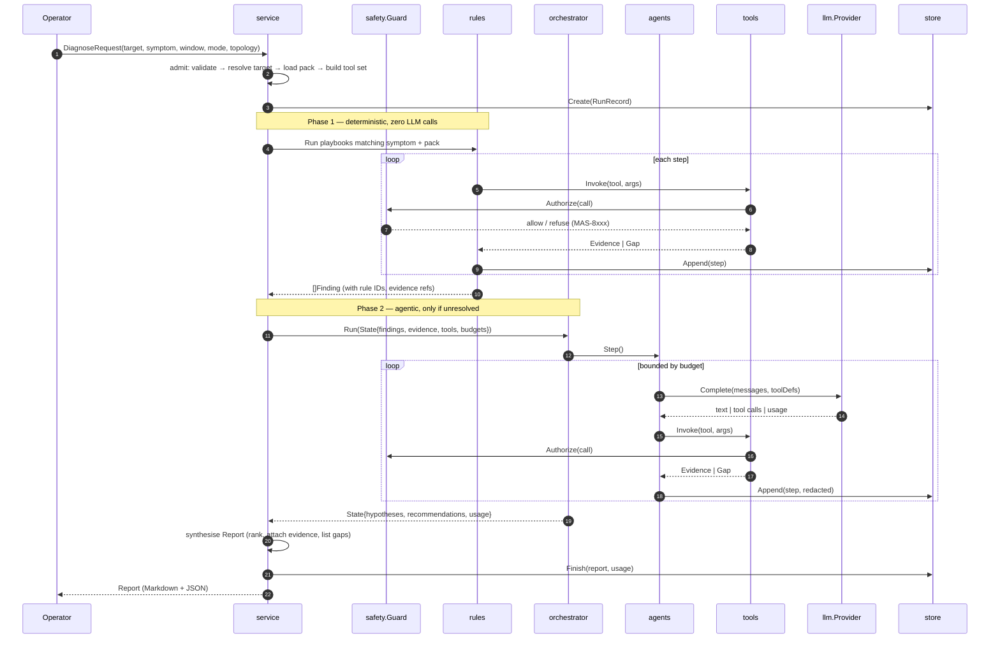
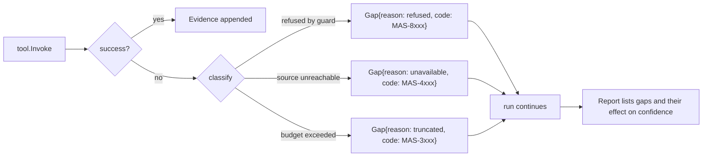
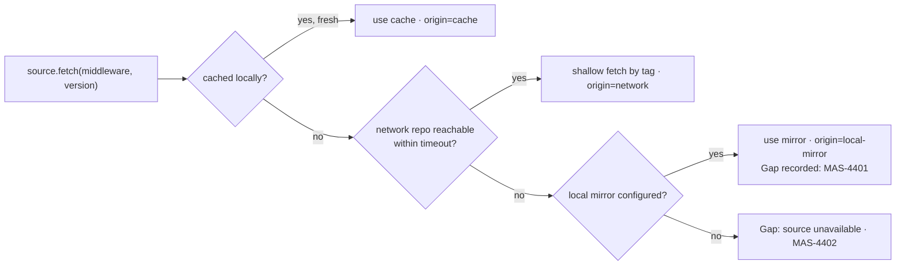
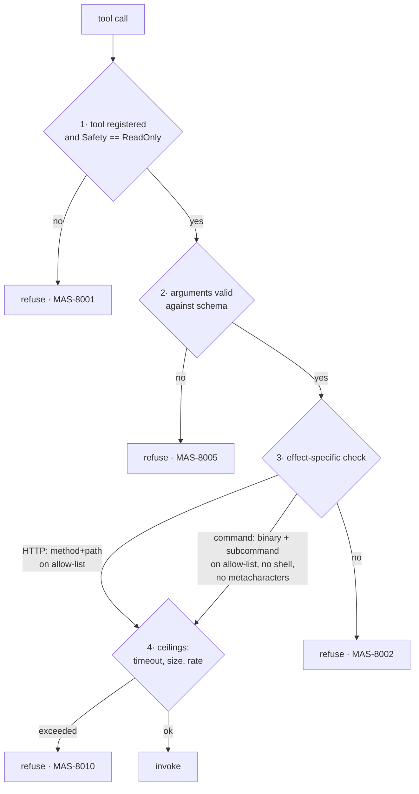

# High-Level Design (HLD): MVP Core

> **Feature ID**: `001-mvp-core` · **Version**: 1.0.0 · **Status**: approved
> **Bilingual pair**: [`design-hld.zh.md`](./design-hld.zh.md) · **Upstream**: [`plan.md`](./plan.md) v1.0.0 · **Downstream**: [`design-lld.md`](./design-lld.md)

## 1. Design goals & forces

| Force | Pressure | Resolution |
|---|---|---|
| Must be trusted against production | Any possibility of mutation kills adoption | One choke point — `safety.Guard` — that every outbound effect passes through; deny-by-default; cannot be disabled by configuration |
| Evidence is heterogeneous | Metrics, logs, cluster objects, host state, source code have nothing in common structurally | A single `Evidence` envelope with a typed payload; everything downstream reasons over evidence, never over raw client responses |
| Model reasoning is slow, costly, non-deterministic | Cannot be on the critical path for questions a rule can answer | Two-phase pipeline: deterministic playbooks run first and their findings become the agents' starting context (Art. VII.3) |
| Topologies must be comparable | An experiment platform, not just a product (G7.3) | `Orchestrator` is the *only* thing that varies between topology runs: identical state, identical tools, identical prior findings |
| Domain knowledge changes faster than code | Six middlewares now, more later | Knowledge is versioned YAML data (`Pack`), never Go code; adding middleware requires no recompilation |
| Runs must be auditable | An unexplainable verdict is worthless in an incident | Every step appends to an append-only `RunRecord`; every hypothesis cites `Evidence` IDs; replay reconstructs the report with no external calls |
| Sources fail | Prometheus down, network partitioned, no cluster credentials | Degradation is a first-class outcome: a failed collection yields a recorded `Gap`, never an aborted run |

## 2. System context (C4 level 1)

MAS-Turbo has **no** edge into the middleware that carries a write. Every edge above is a read.

## 3. Container / component decomposition (C4 level 2)

| Component | Responsibility | Depends on | Varies? |
|---|---|---|---|
| `errs` | Error-code registry, coded error type, bilingual messages | — | no |
| `obs` | Structured logging, run context, redacting handler, self-metrics | `errs`, `safety` | no |
| `config` | Load + merge + validate configuration | `errs` | no |
| `core` | Domain model: `Target`, `Request`, `Evidence`, `Finding`, `Hypothesis`, `Report`, `RunRecord` | `errs` only | no |
| `safety` | `Guard` (authorise every effect), `Redactor` | `errs`, `config` | no |
| `tool` | `Tool` interface, registry, argument schema, guarded invocation | `safety`, `core` | **plugin** |
| `collector/promql`, `collector/loki` | Telemetry clients + their tools | `tool`, `config` | **plugin** |
| `envadapter/kube`, `envadapter/local` | Environment reads + their tools | `tool`, `config` | **plugin** |
| `source` | Source acquisition (network → local fallback) + code search | `tool`, `config` | no |
| `knowledge` | Pack schema, validation, embedded + user packs | `core`, `errs` | **data plugin** |
| `rules` | Deterministic playbook engine | `knowledge`, `tool`, `core` | no |
| `llm` | `Provider` interface + registry | `errs`, `safety` | **plugin** |
| `agent` | Roles, prompt assembly, tool loop, budgets | `llm`, `tool`, `core`, `knowledge` | **plugin** |
| `orchestrator` | Topologies | `agent`, `core` | **plugin** |
| `report` | Markdown + JSON renderers | `core` | no |
| `store` | `RunStore` interface + filesystem implementation | `core` | **plugin** |
| `service` | Admission, two-phase pipeline, degradation, accounting | everything above | no |
| `httpapi`, `cli` | Surfaces | `service` | no |

Dependency rule: **arrows point downward only.** `core` imports nothing from this repository
except `errs`. A `go test` in CI asserts the layering (`TestNoUpwardImports`).

## 4. Key abstractions

Exactly six interfaces exist. Each is justified against Constitution Art. VII.1.

### 4.1 `tool.Tool` — a guarded, schema'd capability

- **Seam**: between "something that wants evidence" (an agent, a playbook) and "something that
  can obtain it" (a collector, an adapter).
- **Contract**: a tool declares a stable `Name`, a JSON-schema `ArgsSchema`, a `Safety`
  classification, and `Invoke(ctx, args) (Evidence, error)`. A tool **may not** perform I/O
  outside `Invoke`, and `Invoke` is only ever reached through `tool.Invoker`, which calls
  `safety.Guard.Authorize` first.
- **Implementations**: `promql.instant`, `promql.range`, `promql.series`, `loki.query`,
  `loki.labels`, `kube.pods`, `kube.logs`, `kube.events`, `kube.nodes`, `kube.workloads`,
  `local.processes`, `local.ports`, `local.resources`, `local.inspect`, `source.fetch`,
  `source.search`, `pack.lookup`, `playbook.run`.
- **Justification**: 18 implementations; it is also the seam every test stubs.

### 4.2 `llm.Provider` — model pluggability

- **Seam**: between agent reasoning and a vendor API.
- **Contract**: `Complete(ctx, Request) (Response, error)` where `Request` carries messages,
  optional tool definitions and a budget; `Response` carries text, tool calls and usage. The
  provider is responsible for translating our canonical tool-call shape to and from the
  vendor's, including emulating tool-calling via structured output where a vendor lacks it.
- **Implementations**: `mock` (scripted, deterministic), `anthropic`, `openai` (OpenAI-compatible
  endpoints: OpenAI, DeepSeek, Qwen, vLLM, Ollama).
- **Justification**: three implementations; `mock` is what makes Art. VI.3 achievable.

### 4.3 `agent.Agent` — a role

- **Seam**: between a topology and the work a single role performs.
- **Contract**: `Role() Role` and `Step(ctx, *State) (Outcome, error)`. An agent reads and
  writes the shared `State`; it never talks to another agent directly — topologies compose
  agents, agents do not compose each other. This is what keeps topologies interchangeable.
- **Implementations**: `Planner`, `Investigator` (parameterised by evidence domain),
  `Correlator`, `Critic`, `Reporter`.
- **Justification**: five implementations; the interface is the unit of behavioural testing.

### 4.4 `orchestrator.Orchestrator` — a topology

- **Seam**: the *only* axis that varies in a topology experiment.
- **Contract**: `Name() string` and `Run(ctx, *State) error`, where `State` is fully populated
  by the service (request, target, pack, deterministic findings, tool set, budgets) before the
  orchestrator starts and fully describes the outcome when it returns.
- **Implementations**: `single` (one generalist agent with all tools — the control condition),
  `supervisor` (planner delegates to specialised investigators, correlator merges, critic
  challenges, reporter writes — the default). M2 adds `plan-execute`, `debate`, `blackboard`.
- **Justification**: two implementations now, three more specified; G7.3 is unachievable
  without it.

### 4.5 `store.RunStore` — persistence

- **Seam**: between the pipeline and where run records live.
- **Contract**: `Create`, `Append`, `Finish`, `Get`, `List`. Append-only within a run.
- **Implementations**: `fs` (filesystem, M1), `memory` (tests). M4 adds a database store.
- **Justification**: two implementations; `memory` is the seam service tests need.

### 4.6 `envadapter.Adapter` — an environment binding

- **Seam**: between a logical target ("redis-prod") and the concrete place it runs.
- **Contract**: `Resolve(ctx, TargetSpec) (Binding, error)` and `Tools() []tool.Tool`. The
  binding carries instance identities, addresses, discovered version and telemetry label
  values, so agents never encode environment specifics.
- **Implementations**: `kube`, `local`.
- **Justification**: two implementations; required by G5.3.

**Deliberately *not* interfaces** (Art. VII.1): the report renderer, the config loader, the
rule engine, the pack loader, the redactor. Each has exactly one implementation and no test
needs to replace it.

## 5. Primary data flows

### 5.1 Diagnostic run — the two-phase pipeline

Phase 2 is skipped entirely when Phase 1 produces a finding whose `Confidence` exceeds the
configured `deterministic_short_circuit` threshold **and** the request did not force agentic
mode. This is the mechanism that makes routine cases cost nothing (G9.1).

### 5.2 Degradation

A `Gap` never aborts a run (FR-013). Only admission failures and a total absence of any usable
evidence source do.

### 5.3 Source acquisition with fallback (G6.3)

The `origin` is recorded in the run and rendered in the report, so a reader always knows
whether the code consulted matched the deployed version.

## 6. Data model (logical)

| Entity | Key fields | Lifetime | Store |
|---|---|---|---|
| `Target` | `id`, `kind`, `version`, `env` (kube/local binding), `labels`, `endpoints` | configuration | `mas.yaml` |
| `DiagnoseRequest` | `target`, `symptom`, `window`, `mode`, `topology`, `budget`, `options` | one run | run record |
| `Evidence` | `id`, `kind`, `source`, `query`, `collected_at`, `payload`, `truncated`, `digest` | one run | run record |
| `Gap` | `id`, `intent`, `reason`, `code`, `impact` | one run | run record |
| `Finding` | `id`, `origin` (rule id \| agent role), `severity`, `statement`, `evidence[]`, `confidence` | one run | run record |
| `Hypothesis` | `id`, `statement`, `confidence`, `supporting[]`, `contradicting[]`, `status`, `rank` | one run | run record |
| `Recommendation` | `statement`, `risk`, `rationale`, `refs[]`, `advisory=true` | one run | report |
| `Report` | `schema=report/v1`, `run_id`, `target`, `window`, `summary`, `hypotheses[]`, `findings[]`, `checks_passed[]`, `gaps[]`, `recommendations[]`, `usage` | permanent | run store |
| `RunRecord` | `id`, `request`, `steps[]` (append-only), `report`, `usage`, `timings`, `versions` | permanent | run store |
| `Pack` | `middleware`, `version_range`, `signals[]`, `log_patterns[]`, `failure_modes[]`, `playbooks[]`, `source[]` | release | YAML |

`Evidence.digest` is a content hash used for deduplication and for replay verification.
`Recommendation.advisory` is a constant `true` in the wire schema — a machine consumer cannot
mistake output for an action taken (CON-003).

## 7. Cross-cutting concerns

### 7.1 Error codes

`MAS-NNNN`, allocated by domain. Every code carries severity, English and Chinese message
templates, and a remediation hint. The registry is the single source of truth; `mas errcodes`
prints it and `docs/*/error-codes.md` is generated from it.

| Range | Domain | Examples |
|---|---|---|
| 1000–1999 | Configuration & request | `MAS-1001` invalid config, `MAS-1005` unknown target, `MAS-1010` invalid time window |
| 2000–2999 | LLM provider | `MAS-2001` provider unavailable, `MAS-2004` unparseable tool call, `MAS-2007` token budget exceeded |
| 3000–3999 | Agents & orchestration | `MAS-3001` unknown topology, `MAS-3005` step budget exceeded, `MAS-3010` no progress |
| 4000–4999 | Collectors & tools | `MAS-4001` metrics endpoint unreachable, `MAS-4101` Loki query rejected, `MAS-4201` Kubernetes forbidden, `MAS-4401` source fell back to local mirror |
| 5000–5999 | Knowledge & rules | `MAS-5001` pack schema violation, `MAS-5010` playbook expression error |
| 6000–6999 | Storage | `MAS-6001` run not found, `MAS-6003` run record corrupt |
| 7000–7999 | API & CLI | `MAS-7001` bad request, `MAS-7404` not found |
| 8000–8999 | Safety | `MAS-8001` mutating operation refused, `MAS-8002` command not allow-listed, `MAS-8005` argument rejected, `MAS-8010` resource ceiling exceeded |
| 9000–9999 | Internal | `MAS-9001` invariant violated |

### 7.2 Logging & tracing

One `slog` logger, JSON by default, wrapped by a redacting handler. Every record carries
`run_id`; records inside a step also carry `step_id`, `component`, `tool` and `duration_ms`.
Errors log `code` and `code_message`. `mas diagnose --log-level debug` additionally logs
prompts and tool arguments — **after** redaction.

### 7.3 Security & safety enforcement

The guard is a single choke point with four independent checks; all four must pass.

Properties that make this defensible rather than decorative:

1. **No bypass path.** Collectors expose no exported method that performs I/O; only
   `tool.Invoker` can reach them, and it always calls the guard first. `TestNoUnguardedIO`
   asserts this by inspecting the call graph.
2. **Commands never see a shell.** `exec.Command` with an argument vector; `sh -c` is absent
   from the codebase and a test asserts its absence.
3. **The allow-list is data, not judgement.** Middleware inspection commands are declared in
   knowledge packs and re-validated by the guard at call time — a pack cannot smuggle a
   mutating command past it, because the guard's own denylist of mutating verbs
   (`SET`, `DEL`, `FLUSHALL`, `CONFIG SET`, `delete`, `apply`, `drop`, `kill`, …) is
   independent of pack content.
4. **The guard cannot be turned off.** There is no configuration key that disables it; the
   only configurable direction is *narrower*.
5. **Redaction is at the handler, not the call site.** Secrets cannot leak by someone
   forgetting to redact at a new call site.

### 7.4 Configuration & precedence

`defaults → config file → environment (MAS_*) → command-line flags`, last wins. Validation is a
separate pass that produces coded errors with the offending path (`targets[2].kind`). Secrets
may be given as `${env:VAR}` or `${file:/path}` references and are resolved late, never stored
in the parsed structure as plaintext beyond a `Secret` type whose `String()` is `"***"`.

## 8. Failure modes & degradation

| Failure | Detection | Degradation | Code |
|---|---|---|---|
| Metrics endpoint down | HTTP error / timeout | Gap; log-only analysis continues | `MAS-4001` |
| Loki down | HTTP error / timeout | Gap; metrics-only analysis continues | `MAS-4101` |
| No Kubernetes credentials | Probe at admission | Offline mode forced; noted in report | `MAS-4202` |
| Kubernetes RBAC forbids a read | 403 | Gap naming the resource; run continues | `MAS-4201` |
| Network unreachable for source | Dial timeout | Fall back to local mirror; recorded | `MAS-4401` |
| LLM provider unavailable | HTTP error | Phase 2 skipped; deterministic findings reported | `MAS-2001` |
| LLM emits invalid tool call | Schema validation | Bounded repair retries, then Phase 2 truncated | `MAS-2004` |
| Agent loop not converging | Step/token/wall-clock budget | Truncate; report what was found, flag truncation | `MAS-3005` |
| Pack invalid | Schema validation at load | Pack rejected, others load, doctor reports it | `MAS-5001` |
| Run record corrupt | Digest mismatch on read | Replay refuses with a precise code | `MAS-6003` |

## 9. Alternatives considered

| Option | Pros | Cons | Verdict |
|---|---|---|---|
| Single ReAct agent with all tools | Simplest; fewer tokens | No role specialisation; no critique step; poor at multi-source correlation; unusable as an experiment control-vs-treatment design | **Kept as the `single` topology** — the control condition, not the default |
| Framework-based orchestration (LangGraph/AutoGen) | Ecosystem, faster start | Python runtime in the image; framework execution model confounds topology comparison; safety guard harder to prove | Rejected; reversal condition in `plan.md` §1 |
| Knowledge as Go code | Type-safe, fast | Recompilation per middleware; excludes third-party authors; violates G2.1 | Rejected |
| LLM-only, no rule engine | Less code | Costly and non-deterministic for cases with a known deterministic answer; violates Art. VII.3 | Rejected |
| Guard as prompt instruction ("do not run writes") | Trivial | Not enforcement; a prompt-injected or confused model bypasses it | Rejected — Art. IV.1 requires enforcement in code |
| Store runs in SQLite | Queryable | Dependency and migration burden for M1; filesystem suffices behind `RunStore` | Deferred to M4 |
| `client-go` for Kubernetes | Complete | +40 MB, wide API surface weakens the allow-list argument | Rejected; `plan.md` §6 |

## 10. Traceability

| Requirement | Realised by |
|---|---|
| FR-001, FR-002 | `service` admission; `config` target resolution; `envadapter.Adapter.Resolve` |
| FR-003 | `collector/promql` + its tools |
| FR-004 | `collector/loki` + its tools |
| FR-005 | `envadapter/kube` |
| FR-006 | `safety.Guard` (§7.3) |
| FR-007 | `knowledge` pack loader |
| FR-008 | `rules` playbook engine (§5.1 Phase 1) |
| FR-009 | `orchestrator` registry (§4.4) |
| FR-010 | `llm` registry (§4.2) |
| FR-011 | `core.Report` + `report` renderers (§6) |
| FR-012 | `store.RunStore` + `RunRecord` (§6) |
| FR-013 | Degradation flow (§5.2) |
| FR-014 | `cli` |
| FR-015 | `httpapi` |
| FR-016 | `safety.Redactor` at the log handler and the store boundary (§7.3.5) |
| FR-017 | `obs` (§7.2), `errs` (§7.1) |
| FR-018 | `service` doctor checks |
| FR-019 | `core.Usage` accumulated by `agent` and `llm` |
| FR-020 | Delivery phase |
| FR-021 | `envadapter/local` |
| FR-022, FR-023 | `source` (§5.3) |
| NFR-001…010 | §7, §8, and the CI gates in `tasks.md` |

## Change Log

| Version | Date | Change | Impact |
|---|---|---|---|
| 1.0.0 | 2026-08-23 | Initial architecture: two-phase pipeline, six interfaces, single-choke-point guard | `design-lld.md` |
