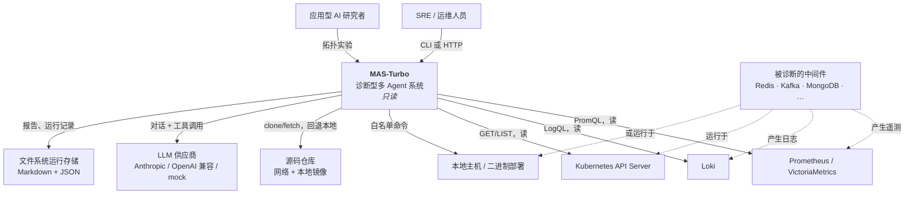
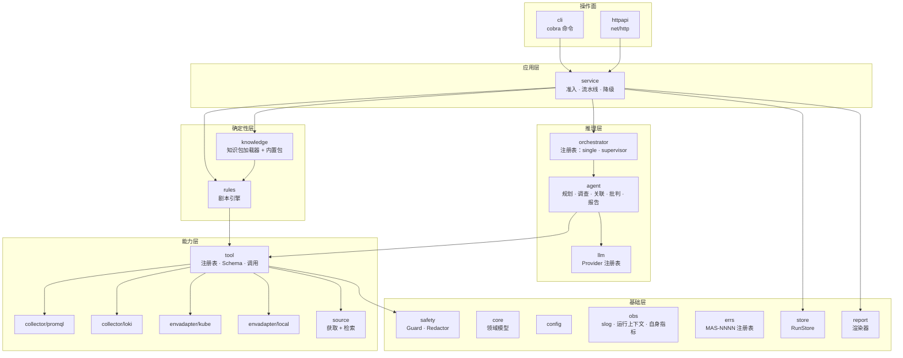
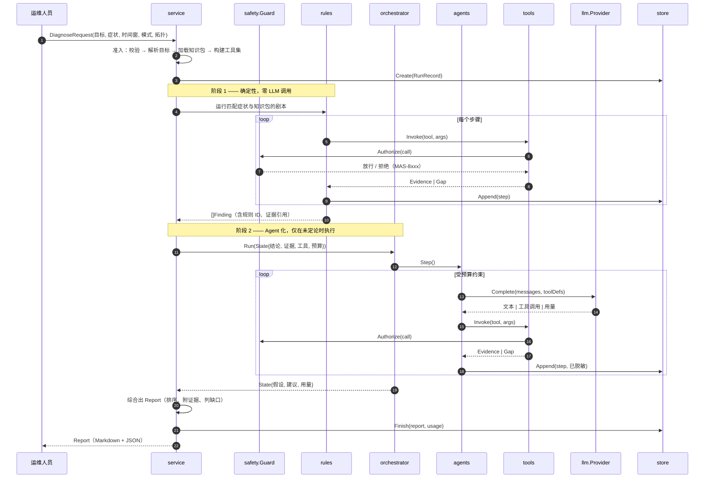
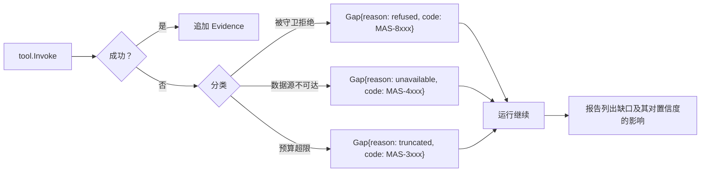
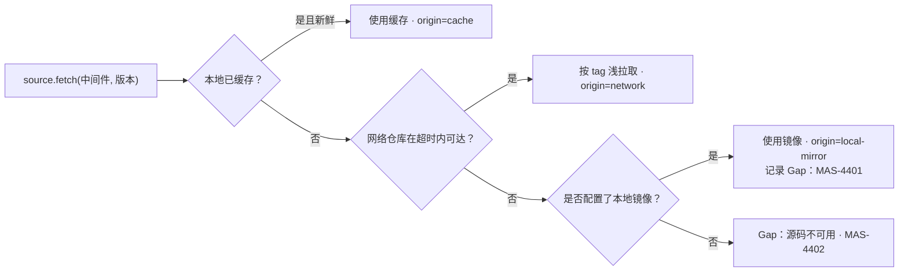
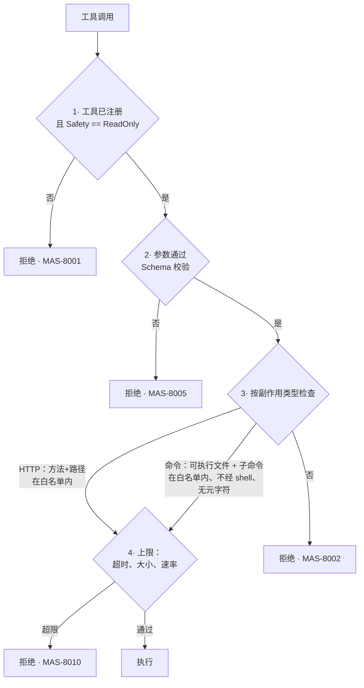

# 概要设计（HLD）：MVP 内核

> **特性 ID**：`001-mvp-core` · **版本**：1.0.0 · **状态**：已批准
> **双语对应文件**：[`design-hld.md`](./design-hld.md) · **上游**：[`plan.zh.md`](./plan.zh.md) v1.0.0 · **下游**：[`design-lld.zh.md`](./design-lld.zh.md)

## 1. 设计目标与受力分析

| 受力 | 压力来源 | 化解方式 |
|---|---|---|
| 必须敢指向生产环境 | 只要存在变更的可能性，就没人敢用 | 单一收口点 —— `safety.Guard` —— 所有对外副作用都必须经过它；默认拒绝；不可由配置关闭 |
| 证据是异构的 | 指标、日志、集群对象、主机状态、源码在结构上毫无共性 | 统一的 `Evidence` 信封 + 带类型的载荷；下游一律基于证据推理，绝不基于原始客户端响应 |
| 模型推理慢、贵、不确定 | 对规则能回答的问题，它不该在关键路径上 | 两阶段流水线：确定性剧本先跑，其结论成为 Agent 的起始上下文（第七条 VII.3） |
| 拓扑必须可比较 | 这是实验平台，不只是产品（G7.3） | `Orchestrator` 是拓扑实验中**唯一**变化的东西：状态相同、工具相同、前置结论相同 |
| 领域知识变化快于代码 | 现在六种中间件，以后更多 | 知识是带版本的 YAML 数据（`Pack`），绝不是 Go 代码；新增中间件无需重新编译 |
| 运行必须可审计 | 无法解释的结论在故障中毫无价值 | 每一步追加到只追加的 `RunRecord`；每条假设引用 `Evidence` ID；重放可在零外部调用下重建报告 |
| 数据源会挂 | Prometheus 挂了、网络断了、没有集群凭据 | 降级是一等结果：采集失败产生一条被记录的 `Gap`，绝不中止运行 |

## 2. 系统上下文（C4 L1）

MAS-Turbo 与中间件之间**不存在**任何带写入的边。上图每一条边都是读。

## 3. 容器 / 组件分解（C4 L2）

| 组件 | 职责 | 依赖 | 是否可变 |
|---|---|---|---|
| `errs` | 错误码注册表、带码错误类型、双语描述 | — | 否 |
| `obs` | 结构化日志、运行上下文、脱敏 handler、自身指标 | `errs`、`safety` | 否 |
| `config` | 配置加载 + 合并 + 校验 | `errs` | 否 |
| `core` | 领域模型：`Target`、`Request`、`Evidence`、`Finding`、`Hypothesis`、`Report`、`RunRecord` | 仅 `errs` | 否 |
| `safety` | `Guard`（授权每次副作用）、`Redactor` | `errs`、`config` | 否 |
| `tool` | `Tool` 接口、注册表、参数 Schema、受守卫调用 | `safety`、`core` | **插件** |
| `collector/promql`、`collector/loki` | 遥测客户端及其工具 | `tool`、`config` | **插件** |
| `envadapter/kube`、`envadapter/local` | 环境读取及其工具 | `tool`、`config` | **插件** |
| `source` | 源码获取（网络 → 本地回退）与代码检索 | `tool`、`config` | 否 |
| `knowledge` | 知识包 Schema、校验、内置 + 用户包 | `core`、`errs` | **数据插件** |
| `rules` | 确定性剧本引擎 | `knowledge`、`tool`、`core` | 否 |
| `llm` | `Provider` 接口 + 注册表 | `errs`、`safety` | **插件** |
| `agent` | 角色、提示词组装、工具循环、预算 | `llm`、`tool`、`core`、`knowledge` | **插件** |
| `orchestrator` | 拓扑 | `agent`、`core` | **插件** |
| `report` | Markdown + JSON 渲染器 | `core` | 否 |
| `store` | `RunStore` 接口 + 文件系统实现 | `core` | **插件** |
| `service` | 准入、两阶段流水线、降级、统计 | 以上全部 | 否 |
| `httpapi`、`cli` | 操作面 | `service` | 否 |

依赖规则：**箭头只能向下。** `core` 除 `errs` 外不引用本仓库任何包。CI 中的 `go test` 断言分层
（`TestNoUpwardImports`）。

## 4. 关键抽象

系统中恰好存在六个接口。每一个都针对宪章 VII.1 给出理由。

### 4.1 `tool.Tool` —— 受守卫的、带 Schema 的能力

- **接缝**：位于“需要证据的一方”（Agent、剧本）与“能拿到证据的一方”（采集器、适配器）之间。
- **契约**：工具声明稳定的 `Name`、JSON Schema 形式的 `ArgsSchema`、`Safety` 分类，以及
  `Invoke(ctx, args) (Evidence, error)`。工具**不得**在 `Invoke` 之外做 I/O；而 `Invoke` 只能
  经由 `tool.Invoker` 到达，后者必先调用 `safety.Guard.Authorize`。
- **实现**：`promql.instant`、`promql.range`、`promql.series`、`loki.query`、`loki.labels`、
  `kube.pods`、`kube.logs`、`kube.events`、`kube.nodes`、`kube.workloads`、`local.processes`、
  `local.ports`、`local.resources`、`local.inspect`、`source.fetch`、`source.search`、
  `pack.lookup`、`playbook.run`。
- **理由**：18 个实现；同时也是每个测试打桩的接缝。

### 4.2 `llm.Provider` —— 模型可插拔

- **接缝**：位于 Agent 推理与厂商 API 之间。
- **契约**：`Complete(ctx, Request) (Response, error)`，`Request` 携带消息、可选工具定义与预算；
  `Response` 携带文本、工具调用与用量。供应商负责在我们规范的工具调用形态与厂商形态之间互译，
  包括在厂商缺乏 tool-calling 时用结构化输出进行模拟。
- **实现**：`mock`（脚本化、确定性）、`anthropic`、`openai`（OpenAI 兼容端点：OpenAI、DeepSeek、
  Qwen、vLLM、Ollama）。
- **理由**：三个实现；`mock` 正是让第六条 VI.3 成为可能的东西。

### 4.3 `agent.Agent` —— 一个角色

- **接缝**：位于拓扑与单个角色所做工作之间。
- **契约**：`Role() Role` 与 `Step(ctx, *State) (Outcome, error)`。Agent 读写共享的 `State`；
  它**绝不**直接与另一个 Agent 通信 —— 由拓扑组合 Agent，Agent 之间不互相组合。正是这一点保证
  了拓扑的可互换性。
- **实现**：`Planner`、`Investigator`（按证据域参数化）、`Correlator`、`Critic`、`Reporter`。
- **理由**：五个实现；该接口是行为测试的单元。

### 4.4 `orchestrator.Orchestrator` —— 一种拓扑

- **接缝**：拓扑实验中**唯一**变化的坐标轴。
- **契约**：`Name() string` 与 `Run(ctx, *State) error`。`State` 在编排器启动前已由 service
  完整填充（请求、目标、知识包、确定性结论、工具集、预算），返回时完整描述结果。
- **实现**：`single`（一个全能 Agent 拥有全部工具 —— 对照组）、`supervisor`（规划者委派给专项
  调查者，关联者合并，批判者挑战，报告者撰写 —— 默认）。M2 增加 `plan-execute`、`debate`、
  `blackboard`。
- **理由**：当前两个实现，另有三个已规格化；没有它 G7.3 无法实现。

### 4.5 `store.RunStore` —— 持久化

- **接缝**：位于流水线与运行记录存放位置之间。
- **契约**：`Create`、`Append`、`Finish`、`Get`、`List`。单次运行内只追加。
- **实现**：`fs`（文件系统，M1）、`memory`（测试）。M4 增加数据库存储。
- **理由**：两个实现；`memory` 正是 service 测试所需的接缝。

### 4.6 `envadapter.Adapter` —— 环境绑定

- **接缝**：位于逻辑目标（“redis-prod”）与它实际运行的具体位置之间。
- **契约**：`Resolve(ctx, TargetSpec) (Binding, error)` 与 `Tools() []tool.Tool`。绑定携带实例
  标识、地址、发现到的版本与遥测标签值，从而使 Agent 永远不必编码环境细节。
- **实现**：`kube`、`local`。
- **理由**：两个实现；G5.3 要求如此。

**刻意*不*做成接口的**（VII.1）：报告渲染器、配置加载器、规则引擎、知识包加载器、脱敏器。
它们各自只有一个实现，且没有任何测试需要替换它们。

## 5. 主要数据流

### 5.1 诊断运行 —— 两阶段流水线

当阶段 1 产出的某条结论其 `Confidence` 超过配置的 `deterministic_short_circuit` 阈值，**且**
请求未强制要求 Agent 模式时，阶段 2 被完全跳过。这正是让常规场景零成本的机制（G9.1）。

### 5.2 降级

`Gap` 绝不中止运行（FR-013）。只有准入失败与“完全没有任何可用证据源”才会中止。

### 5.3 带回退的源码获取（G6.3）

`origin` 会被记录进运行记录并在报告中呈现，读者因此总能知道所参考的代码是否与部署版本一致。

## 6. 数据模型（逻辑层）

| 实体 | 关键字段 | 生命周期 | 存储 |
|---|---|---|---|
| `Target` | `id`、`kind`、`version`、`env`（kube/local 绑定）、`labels`、`endpoints` | 配置 | `mas.yaml` |
| `DiagnoseRequest` | `target`、`symptom`、`window`、`mode`、`topology`、`budget`、`options` | 单次运行 | 运行记录 |
| `Evidence` | `id`、`kind`、`source`、`query`、`collected_at`、`payload`、`truncated`、`digest` | 单次运行 | 运行记录 |
| `Gap` | `id`、`intent`、`reason`、`code`、`impact` | 单次运行 | 运行记录 |
| `Finding` | `id`、`origin`（规则 ID \| Agent 角色）、`severity`、`statement`、`evidence[]`、`confidence` | 单次运行 | 运行记录 |
| `Hypothesis` | `id`、`statement`、`confidence`、`supporting[]`、`contradicting[]`、`status`、`rank` | 单次运行 | 运行记录 |
| `Recommendation` | `statement`、`risk`、`rationale`、`refs[]`、`advisory=true` | 单次运行 | 报告 |
| `Report` | `schema=report/v1`、`run_id`、`target`、`window`、`summary`、`hypotheses[]`、`findings[]`、`checks_passed[]`、`gaps[]`、`recommendations[]`、`usage` | 永久 | 运行存储 |
| `RunRecord` | `id`、`request`、`steps[]`（只追加）、`report`、`usage`、`timings`、`versions` | 永久 | 运行存储 |
| `Pack` | `middleware`、`version_range`、`signals[]`、`log_patterns[]`、`failure_modes[]`、`playbooks[]`、`source[]` | 随版本发布 | YAML |

`Evidence.digest` 是内容哈希，用于去重与重放校验。
`Recommendation.advisory` 在传输 Schema 中恒为 `true` —— 机器消费者不可能把输出误认为“已执行的
动作”（CON-003）。

## 7. 横切关注点

### 7.1 错误码

`MAS-NNNN`，按域分配。每个错误码携带严重级别、中英文描述模板与修复建议。注册表是唯一真相来源；
`mas errcodes` 打印它，`docs/*/error-codes.md` 由它生成。

| 区段 | 领域 | 示例 |
|---|---|---|
| 1000–1999 | 配置与请求 | `MAS-1001` 配置非法、`MAS-1005` 未知目标、`MAS-1010` 时间窗非法 |
| 2000–2999 | LLM 供应商 | `MAS-2001` 供应商不可用、`MAS-2004` 工具调用无法解析、`MAS-2007` token 预算超限 |
| 3000–3999 | Agent 与编排 | `MAS-3001` 未知拓扑、`MAS-3005` 步数预算超限、`MAS-3010` 无进展 |
| 4000–4999 | 采集器与工具 | `MAS-4001` 指标端点不可达、`MAS-4101` Loki 查询被拒、`MAS-4201` Kubernetes 无权限、`MAS-4401` 源码回退到本地镜像 |
| 5000–5999 | 知识与规则 | `MAS-5001` 知识包 Schema 违规、`MAS-5010` 剧本表达式错误 |
| 6000–6999 | 存储 | `MAS-6001` 运行不存在、`MAS-6003` 运行记录损坏 |
| 7000–7999 | API 与 CLI | `MAS-7001` 请求非法、`MAS-7404` 未找到 |
| 8000–8999 | 安全 | `MAS-8001` 拒绝变更类操作、`MAS-8002` 命令不在白名单、`MAS-8005` 参数被拒、`MAS-8010` 资源上限超限 |
| 9000–9999 | 内部 | `MAS-9001` 不变量被破坏 |

### 7.2 日志与追踪

单一 `slog` logger，默认 JSON，外层包一个脱敏 handler。每条记录携带 `run_id`；步骤内的记录另
携带 `step_id`、`component`、`tool` 与 `duration_ms`。错误记录 `code` 与 `code_message`。
`mas diagnose --log-level debug` 会额外记录提示词与工具参数 —— **在脱敏之后**。

### 7.3 安全与只读强制

守卫是单一收口点，包含四道互相独立的检查；四道全过才放行。

让这套机制成为真正的强制而非装饰的几个性质：

1. **不存在旁路。** 采集器不导出任何会做 I/O 的方法；只有 `tool.Invoker` 能到达它们，而它总是
   先调用守卫。`TestNoUnguardedIO` 通过检查调用图断言这一点。
2. **命令永不经过 shell。** 使用 `exec.Command` 加参数数组；代码库中不存在 `sh -c`，并有测试
   断言其不存在。
3. **白名单是数据，不是判断。** 中间件巡检命令在知识包中声明，并在调用时由守卫重新校验 ——
   知识包无法把变更类命令偷渡过去，因为守卫自身的变更类动词黑名单（`SET`、`DEL`、`FLUSHALL`、
   `CONFIG SET`、`delete`、`apply`、`drop`、`kill` …）与知识包内容彼此独立。
4. **守卫无法被关闭。** 不存在任何可以禁用它的配置项；唯一可配置的方向是**更严**。
5. **脱敏发生在 handler 层，而非调用点。** 密钥不会因为某人在新调用点忘记脱敏而泄漏。

### 7.4 配置与优先级

`默认值 → 配置文件 → 环境变量（MAS_*） → 命令行参数`，后者覆盖前者。校验是独立的一遍，产出带
错误码且指明出错路径（`targets[2].kind`）的错误。密钥可写作 `${env:VAR}` 或 `${file:/path}`
引用，延迟解析，除 `Secret` 类型（其 `String()` 返回 `"***"`）外绝不以明文形式留在解析后的结构中。

## 8. 失效模式与降级

| 失效 | 检测方式 | 降级行为 | 错误码 |
|---|---|---|---|
| 指标端点不可用 | HTTP 错误 / 超时 | 记 Gap；仅日志分析继续 | `MAS-4001` |
| Loki 不可用 | HTTP 错误 / 超时 | 记 Gap；仅指标分析继续 | `MAS-4101` |
| 无 Kubernetes 凭据 | 准入时探测 | 强制离线模式；报告中说明 | `MAS-4202` |
| Kubernetes RBAC 禁止某次读 | 403 | 记 Gap 并指明资源；运行继续 | `MAS-4201` |
| 源码网络不可达 | 拨号超时 | 回退到本地镜像；被记录 | `MAS-4401` |
| LLM 供应商不可用 | HTTP 错误 | 跳过阶段 2；输出确定性结论 | `MAS-2001` |
| LLM 产出非法工具调用 | Schema 校验 | 有界修复重试，其后截断阶段 2 | `MAS-2004` |
| Agent 循环不收敛 | 步数/token/墙钟预算 | 截断；输出已获结论并标注截断 | `MAS-3005` |
| 知识包非法 | 加载时 Schema 校验 | 拒绝该包，其余照常加载，doctor 报告 | `MAS-5001` |
| 运行记录损坏 | 读取时摘要不匹配 | 重放以精确错误码拒绝 | `MAS-6003` |

## 9. 备选方案

| 方案 | 优点 | 缺点 | 结论 |
|---|---|---|---|
| 单个持有全部工具的 ReAct Agent | 最简单；token 更少 | 无角色分工；无批判环节；多源关联能力弱；无法充当实验的对照/处理设计 | **保留为 `single` 拓扑** —— 作为对照组，而非默认 |
| 基于框架的编排（LangGraph/AutoGen） | 生态好、起步快 | 镜像里要塞 Python 运行时；框架执行模型会混杂拓扑对比；安全守卫更难证明 | 否决；反转条件见 `plan.zh.md` §1 |
| 知识以 Go 代码承载 | 类型安全、快 | 每种中间件都要重编译；排除第三方作者；违反 G2.1 | 否决 |
| 纯 LLM、不要规则引擎 | 代码更少 | 对有确定答案的场景既贵又不确定；违反第七条 VII.3 | 否决 |
| 守卫做成提示词约束（“不要执行写操作”） | 实现简单 | 那不是强制；被提示词注入或产生幻觉的模型可以绕过 | 否决 —— 第四条 IV.1 要求代码级强制 |
| 用 SQLite 存运行记录 | 可查询 | M1 阶段带来依赖与迁移负担；文件系统在 `RunStore` 之后已足够 | 推迟到 M4 |
| Kubernetes 使用 `client-go` | 功能完备 | +40 MB，宽 API 面削弱白名单论证 | 否决；见 `plan.zh.md` §6 |

## 10. 可追溯性

| 需求 | 由谁实现 |
|---|---|
| FR-001、FR-002 | `service` 准入；`config` 目标解析；`envadapter.Adapter.Resolve` |
| FR-003 | `collector/promql` 及其工具 |
| FR-004 | `collector/loki` 及其工具 |
| FR-005 | `envadapter/kube` |
| FR-006 | `safety.Guard`（§7.3） |
| FR-007 | `knowledge` 知识包加载器 |
| FR-008 | `rules` 剧本引擎（§5.1 阶段 1） |
| FR-009 | `orchestrator` 注册表（§4.4） |
| FR-010 | `llm` 注册表（§4.2） |
| FR-011 | `core.Report` + `report` 渲染器（§6） |
| FR-012 | `store.RunStore` + `RunRecord`（§6） |
| FR-013 | 降级流程（§5.2） |
| FR-014 | `cli` |
| FR-015 | `httpapi` |
| FR-016 | 日志 handler 与存储边界上的 `safety.Redactor`（§7.3.5） |
| FR-017 | `obs`（§7.2）、`errs`（§7.1） |
| FR-018 | `service` 的 doctor 检查 |
| FR-019 | 由 `agent` 与 `llm` 累积的 `core.Usage` |
| FR-020 | 交付阶段 |
| FR-021 | `envadapter/local` |
| FR-022、FR-023 | `source`（§5.3） |
| NFR-001…010 | §7、§8 以及 `tasks.zh.md` 中的 CI 闸门 |

## Change Log

| 版本 | 日期 | 变更 | 影响 |
|---|---|---|---|
| 1.0.0 | 2026-08-23 | 初版架构：两阶段流水线、六个接口、单一收口守卫 | `design-lld.zh.md` |
