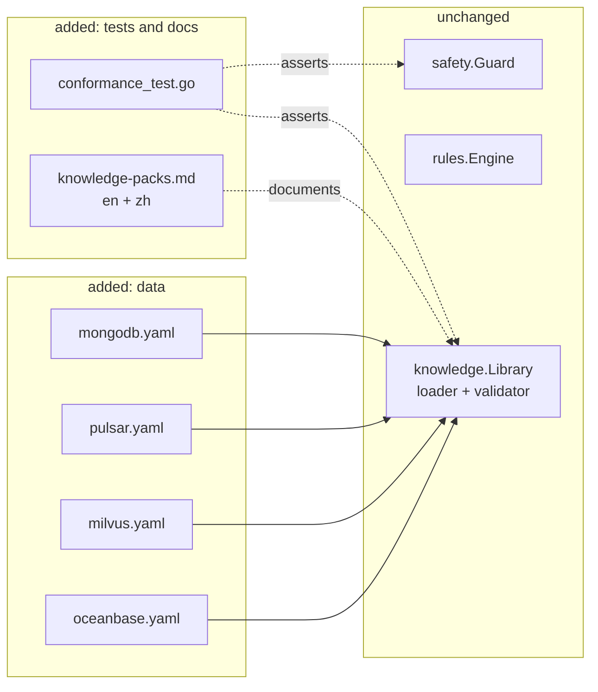

# High-Level Design (HLD): Middleware Knowledge Breadth

> **Feature ID**: `002-middleware-packs` · **Version**: 1.0.0 · **Status**: approved
> **Bilingual pair**: [`design-hld.zh.md`](./design-hld.zh.md) · **Upstream**: [`plan.md`](./plan.md) v1.0.0 · **Downstream**: [`design-lld.md`](./design-lld.md)

## 1. Design goals & forces

| Force | Pressure | Resolution |
|---|---|---|
| Four packs written in one pass risk being shallow | Depth is what makes a pack worth having | A conformance test written *first* sets a floor no pack can fall below, and it applies to the two existing packs too |
| Plausible-but-wrong knowledge is worse than none | An operator acts on it | Every signal is a real exporter metric; every failure mode explains a mechanism; anything destructive is labelled high risk |
| Exporter metric names drift | A pack silently stops detecting anything | The engine already treats a missing signal as a gap rather than a passing check; the pack only needs to not lie about coverage |
| The architecture claims data-only extension | If this feature needs a code change, that claim was wrong | CON-004 forbids touching the loader, making this the claim's first real test |

## 2. What this feature adds

There is no new component and no new interface. That is the design.

## 3. What a pack must contain, and why

The conformance floor is not arbitrary. Each element exists because removing it
leaves a diagnosis measurably worse:

| Element | Minimum | Why this floor |
|---|---|---|
| `signals` | 10 | Below roughly ten series, a playbook cannot distinguish causes from effects — it can only report that something is wrong |
| `logPatterns` | 6 | Logs are where a middleware states its own diagnosis; a pack with few patterns cannot read it |
| `failureModes` | 6 | Fewer than this and the pack cannot express the alternatives a critic must weigh |
| `playbooks` | 3 | One always-on health check plus at least two symptom-directed ones |
| recommendations | ≥1 per failure mode | A failure mode with no advice tells an operator they have a problem and nothing else |

## 4. The shape each pack shares

Every pack follows the same three-playbook skeleton, because the same three
questions arise in every incident:

1. **An always-on availability playbook** (no `matches` terms, so it always runs):
   is the thing up, and did it restart inside the window? Almost every other
   conclusion is unreliable until this is settled.
2. **A capacity or backlog playbook**: is it running out of something —
   memory, disk, connections, unacknowledged work?
3. **A latency or health playbook**: is it slow, and is that explained by load
   or by one blocking operation?

Beyond those, each pack adds what is specific to its middleware: replication for
MongoDB, ledger health for Pulsar, compaction and index build for Milvus, tenant
resource limits and merges for OceanBase.

## 5. Failure-mode coverage per middleware

| Middleware | Failure modes |
|---|---|
| MongoDB | replication lag, primary step-down / election, connection saturation, slow queries and missing indexes, lock contention, storage and oplog pressure, write-concern stalls |
| Pulsar | subscription backlog growth, bookie storage pressure, ledger write failures, broker overload, topic unavailability, consumer stall |
| Milvus | query-node latency, compaction backlog, index build failure, memory pressure, data-node flush lag, dependency failure (etcd, object storage) |
| OceanBase | tenant memory exhaustion, tenant CPU throttling, major merge delay, slow SQL, clog synchronisation lag, disk pressure |

## 6. Cross-cutting concerns

### 6.1 Error codes

No new codes. Pack problems already map onto `MAS-5001` … `MAS-5014`.

### 6.2 Safety

Each pack declares read-only inspection commands. Three of the four need
binaries the guard already permits (`mongosh`, `pulsar-admin`); Milvus and
OceanBase are inspected through their HTTP metrics endpoints and SQL respectively,
so where no allow-listed read-only path exists, the pack declares **no** inspect
command rather than requesting a new allow-list entry. Widening the guard is a
specification change, and this feature's specification does not ask for one.

### 6.3 Honesty about coverage

NFR-002 is the subtle requirement. A pack must not name a failure mode it cannot
detect. The conformance test cross-checks each failure mode's `indicators`
against the pack's declared signals and log patterns, so a pack cannot advertise
depth it does not have.

## 7. Alternatives considered

| Option | Pros | Cons | Verdict |
|---|---|---|---|
| Generate packs from exporter metric dumps | Fast, exhaustive metric coverage | Produces signals with no judgement attached — a list of metrics is not expertise | Rejected |
| One deep pack instead of four shallow ones | Higher quality per pack | Leaves three of the goal's named middlewares unserved, and the conformance floor exists precisely to prevent shallowness | Rejected |
| Extend the schema for middleware-specific constructs | Expressive | Violates CON-004 and undermines the data-only claim | Rejected; record any genuine gap as a finding instead |

## 8. Traceability

| Requirement | Realised by |
|---|---|
| FR-001 … FR-004 | The four pack files (§5) |
| FR-005, FR-007, FR-009, NFR-002 | `conformance_test.go` (§3, §6.3) |
| FR-006 | Conformance test's guard pass (§6.2) |
| FR-008 | `docs/{en,zh}/knowledge-packs.md` |
| FR-010 | The absence of loader changes, asserted by review and by the test suite continuing to pass unchanged |

## Change Log

| Version | Date | Change | Impact |
|---|---|---|---|
| 1.0.0 | 2026-08-24 | Initial design | `design-lld.md` |
