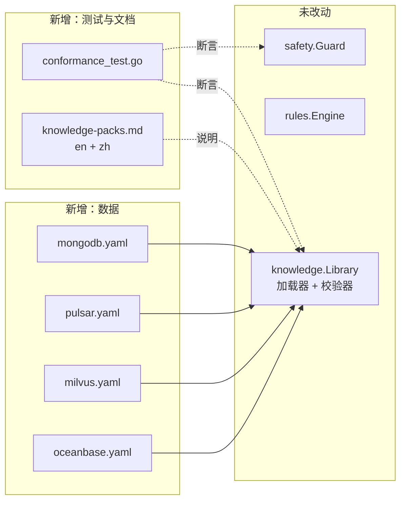

# 概要设计（HLD）：中间件知识广度

> **特性 ID**：`002-middleware-packs` · **版本**：1.0.0 · **状态**：已批准
> **双语对应文件**：[`design-hld.md`](./design-hld.md) · **上游**：[`plan.zh.md`](./plan.zh.md) v1.0.0 · **下游**：[`design-lld.zh.md`](./design-lld.zh.md)

## 1. 设计目标与受力分析

| 受力 | 压力来源 | 化解方式 |
|---|---|---|
| 一次性写四个包，容易写浅 | 深度才是知识包的价值所在 | **先**写一致性测试，为任何包设定不可低于的下限，并且同样适用于已有的两个包 |
| 似是而非的知识比没有知识更糟 | 运维人员会照着它行动 | 每个信号都是真实 exporter 指标；每个失效模式解释的是机制；任何破坏性动作都标为高风险 |
| exporter 指标名会漂移 | 知识包可能悄无声息地失效 | 引擎已经把缺失信号视为缺口而非“检查通过”；知识包只需不谎报覆盖范围 |
| 架构声称“仅靠数据即可扩展” | 若本特性需要改代码，那这个论断就是错的 | CON-004 禁止触碰加载器，使本特性成为该论断的第一次真实检验 |

## 2. 本特性新增了什么

没有新组件，也没有新接口。这本身就是设计。

## 3. 知识包必须包含什么，以及为什么

一致性下限不是拍脑袋定的。每一项之所以存在，是因为去掉它会让诊断质量明显下降：

| 元素 | 下限 | 该下限的理由 |
|---|---|---|
| `signals` | 10 | 少于约十条序列时，剧本就无法把原因与结果区分开 —— 只能报告“出了点问题” |
| `logPatterns` | 6 | 日志是中间件自己给出诊断的地方；模式太少的包读不懂它 |
| `failureModes` | 6 | 少于这个数量，包就无法表达批判者需要权衡的备选解释 |
| `playbooks` | 3 | 一个常开健康检查，外加至少两个按症状触发的剧本 |
| recommendations | 每个失效模式 ≥1 | 一个没有建议的失效模式，只是告诉运维人员“你有麻烦了”，此外什么也没说 |

## 4. 每个包共享的形态

每个包都遵循同样的三剧本骨架，因为每次故障中都会浮现同样的三个问题：

1. **常开可用性剧本**（无 `matches` 条目，因此总会运行）：它还在吗？在时间窗内重启过吗？
   在这一点定论之前，几乎所有其他结论都不可靠。
2. **容量或积压剧本**：它是不是快用完了什么 —— 内存、磁盘、连接、未确认的工作？
3. **时延或健康剧本**：它是不是变慢了？这能否用负载解释，还是由某个阻塞操作造成？

在此之上，每个包再补充其中间件特有的部分：MongoDB 的复制、Pulsar 的 ledger 健康、
Milvus 的 compaction 与索引构建、OceanBase 的租户资源上限与合并。

## 5. 各中间件的失效模式覆盖

| 中间件 | 失效模式 |
|---|---|
| MongoDB | 复制滞后、主节点降级/选举、连接饱和、慢查询与缺失索引、锁竞争、存储与 oplog 压力、写关注卡顿 |
| Pulsar | 订阅积压增长、bookie 存储压力、ledger 写入失败、broker 过载、topic 不可用、消费者停滞 |
| Milvus | 查询节点时延、compaction 积压、索引构建失败、内存压力、data node flush 滞后、依赖组件故障（etcd、对象存储） |
| OceanBase | 租户内存耗尽、租户 CPU 限流、大合并延迟、慢 SQL、clog 同步滞后、磁盘压力 |

## 6. 横切关注点

### 6.1 错误码

无新增。知识包相关问题已经落在 `MAS-5001` … `MAS-5014` 上。

### 6.2 安全

每个包都会声明只读巡检命令。四者中有三者需要的可执行文件守卫已经允许（`mongosh`、
`pulsar-admin`）；Milvus 与 OceanBase 分别通过其 HTTP 指标端点与 SQL 巡检，因此在没有既有
只读白名单路径的情况下，这些包**不声明**任何 inspect 命令，而不是请求新增白名单条目。
放宽守卫属于规格变更，而本特性的规格并未提出这一诉求。

### 6.3 对覆盖范围保持诚实

NFR-002 是那条微妙的要求：知识包不得声称一个它无法检测的失效模式。一致性测试会把每个失效模式
的 `indicators` 与该包已声明的信号和日志模式交叉核对，因此包无法宣传它并不具备的深度。

## 7. 备选方案

| 方案 | 优点 | 缺点 | 结论 |
|---|---|---|---|
| 从 exporter 指标 dump 自动生成知识包 | 快，指标覆盖详尽 | 产出的信号不附带任何判断 —— 一份指标清单不等于专业知识 | 否决 |
| 只做一个深包，而不是四个浅包 | 单包质量更高 | 会让目标中点名的三种中间件无人服务；而一致性下限的存在正是为了防止“浅” | 否决 |
| 为中间件特异性构造扩展 Schema | 表达力更强 | 违反 CON-004，并瓦解“仅靠数据扩展”的论断 | 否决；真有缺口则记录为发现 |

## 8. 可追溯性

| 需求 | 由谁实现 |
|---|---|
| FR-001 … FR-004 | 四个知识包文件（§5） |
| FR-005、FR-007、FR-009、NFR-002 | `conformance_test.go`（§3、§6.3） |
| FR-006 | 一致性测试中的守卫校验环节（§6.2） |
| FR-008 | `docs/{en,zh}/knowledge-packs.md` |
| FR-010 | 不存在加载器改动这一事实，由评审与既有测试套件继续无改动通过共同验证 |

## Change Log

| 版本 | 日期 | 变更 | 影响 |
|---|---|---|---|
| 1.0.0 | 2026-08-24 | 初版设计 | `design-lld.zh.md` |
